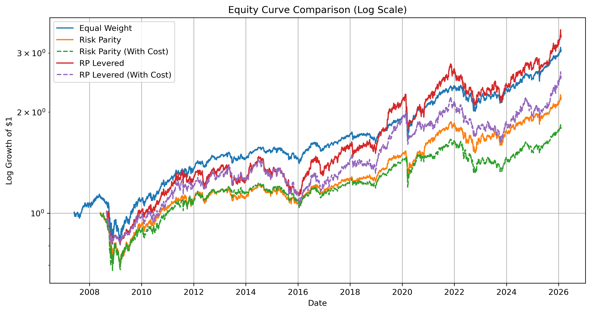

Leveraged Risk Parity Portfolio Backtest

## Equity Curve Comparison




 Overview
This project implements and backtests a multi-asset portfolio strategy using:

- Equal Weight Portfolio
- Risk Parity Portfolio
- Risk Parity with Transaction Costs
- Risk Parity with Volatility Targeting Leverage
- Leveraged Risk Parity with Transaction Costs

The goal is to compare performance and risk characteristics across strategies using professional portfolio metrics.

---

 Asset Universe
The portfolio is constructed using the following ETFs:

- SPY (US Equity)
- EFA (International Equity)
- IEF (Intermediate Treasuries)
- TLT (Long Treasuries)
- GLD (Gold)
- DBC (Commodities)
- VNQ (REITs)
- BIL (Cash / T-Bills proxy)

---

 Methodology

 Risk Parity Allocation
Risk parity weights are computed using a rolling covariance matrix estimated from historical returns.
The optimizer allocates capital such that each asset contributes equally to portfolio risk.

 Rebalancing
- Monthly Rebalancing
- Covariance Lookback Window = 252 trading days

 Leverage Overlay (Volatility Targeting)
A volatility targeting overlay is applied:

- Target Volatility = 12% annualized
- Rolling Volatility Window = 63 days
- Maximum Leverage = 2.0x

 Transaction Costs
Transaction costs are modelled using turnover:

Cost = Turnover × Cost Rate  
Cost Rate = 0.10% (10 bps per dollar traded)

---

 Performance Metrics
The strategies are evaluated using:

- CAGR
- Annualized Volatility
- Sharpe Ratio
- Sortino Ratio
- Maximum Drawdown
- Calmar Ratio
- Rolling Returns (1Y / 3Y / 5Y)
- Rolling Volatility
- Rolling Sharpe Ratio
- Turnover Analysis

---

 Key Visualizations

 Equity Curve Comparison


 Drawdown Comparison


 Risk Parity Allocation Over Time


 Rolling Sharpe Ratio


---

 How to Run

 Install dependencies
```bash
pip install -r requirements.txt


## Author
Nidhirr Agrawal
